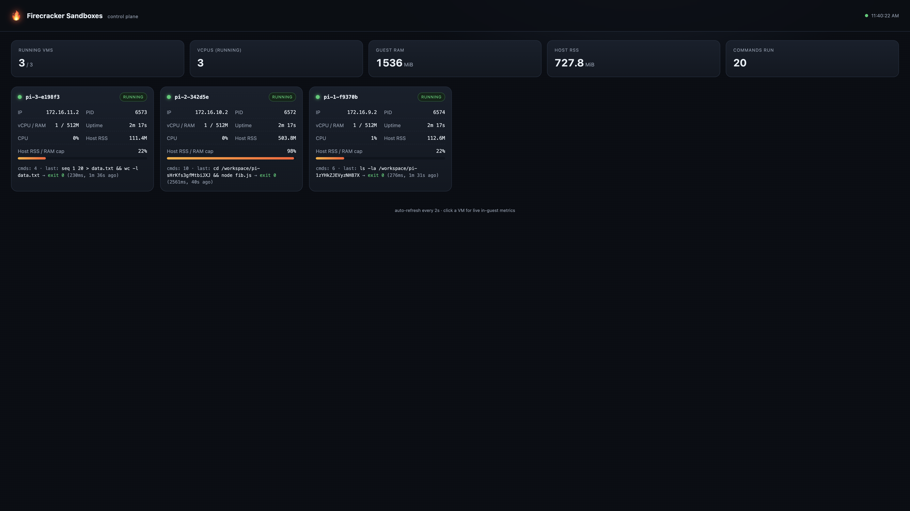

# Firecracker sandboxes for AI agent harnesses

A small, self-hosted clone of Vercel Sandbox. Each AI agent session runs in its
own Firecracker microVM with a dedicated kernel, private filesystem, and own
network, so multiple coding agents run in parallel without seeing each other or
the host. You attach it to the AI SDK `HarnessAgent` with one function, the same
way you'd use Vercel's sandbox, but on your own machine.

> **Proof of concept.** This is an educational demo, not production software. It
> skips snapshot/restore persistence, an egress firewall, multi-host scheduling,
> real authn/authz, and resource quotas, and it hasn't been security-hardened.
> Don't run untrusted workloads against it or expose the control plane beyond
> localhost.


## Setup

### 1. Start the server (once)

```bash
limactl start --tty=false --name=fc fcsandbox/lima-fc.yaml          # create the Linux VM (one time)
limactl shell fc -- bash -lc \
  'export FC_STATE_DIR=$HOME/fcstate PORT=7070; cd '"$PWD"'; bash fcsandbox/server.sh'
```

On a Linux `.metal` host, skip Lima and run `bash fcsandbox/server.sh`.

### 2. Write your harness agent

Point `createFirecrackerSandbox` at the server and pass it to a `HarnessAgent`
(full version in `fcsandbox/example.mjs`):

```js
import { HarnessAgent } from '@ai-sdk/harness/agent';
import { createPi } from '@ai-sdk/harness-pi';
import { createFirecrackerSandbox } from './fcsandbox/provider.mjs';

const sandbox = createFirecrackerSandbox({ baseUrl: 'http://127.0.0.1:7070' });

const agent = new HarnessAgent({
  harness: createPi({
    model: 'anthropic/claude-sonnet-4-5',
    auth: { customEnv: { ANTHROPIC_API_KEY: process.env.ANTHROPIC_API_KEY } },
  }),
  sandbox,                 // ← each session runs in its own Firecracker microVM
  permissionMode: 'allow-all',
});

const session = await agent.createSession();
const result = await agent.stream({ session, prompt: 'Write hello.txt with a haiku, then cat it.' });
for await (const part of result.stream) {
  if (part.type === 'text-delta') process.stdout.write(part.text);
}
await session.destroy();   // or leave it running to watch in the dashboard
```

### 3. Run it

```bash
ANTHROPIC_API_KEY=sk-... node fcsandbox/example.mjs "Build a small CLI todo app"
```

### 4. Done

Watch it live at **http://127.0.0.1:7070/**. Clean up any sandboxes you left
running with `npm run cleanup`.

## How it works

Two sides, connected by plain HTTP:

```
  YOUR MAC                                THE LINUX VM (has /dev/kvm)
  Pi HarnessAgent                         control-plane.mjs ("the server")
   └─ createFirecrackerSandbox()  ──HTTP──▶  REST API + dashboard
      (model API key stays here)   :7070     └─ spawns one microVM per session
                                                vm1 · vm2 · vm3  (separate kernels)
```

- The harness runs on your Mac and only makes HTTP calls. It never touches a VM
  directly, the same way `@vercel/sandbox` only talks to `vercel.com/api`.
- The control plane runs inside a Linux VM (Firecracker needs `/dev/kvm`) and
  routes every command and file op into the right microVM.
- Each microVM is a real, separate machine. On a Mac the Linux VM comes from Lima
  with nested virtualization (Apple Silicon M3+/macOS 15+); on a Linux `.metal`
  host you run the server directly.

See `fcsandbox/` for the pieces: `firecracker-sandbox.sh` (boots microVMs),
`control-plane.mjs` (server + dashboard), `drivers.mjs`, `db.mjs`, `ui.html`,
`provider.mjs` (the function you attach to the harness), `example.mjs` (a minimal
agent), and `pi-cleanup.mjs` (tear down).

## Dashboard

The control plane serves a live dashboard showing every microVM: status, CPU,
memory, uptime, command history, and live in-guest metrics on click.



## How this fits into AI SDK harnesses

`HarnessAgent` is experimental. It ships in the [AI SDK 7](https://ai-sdk.dev/)
canary, and the harness/sandbox packages are marked experimental with breaking
changes expected between releases.

AI SDK keeps two abstractions separate:

- **Harness adapters** are the agent runtime. Currently Claude Code
  (`@ai-sdk/harness-claude-code`), Codex, and Pi (`@ai-sdk/harness-pi`).
- **Sandbox providers** are where that runtime executes. Shipped today: Vercel
  Sandbox (`@ai-sdk/sandbox-vercel`, Firecracker microVMs in Vercel's cloud) and
  just-bash (`@ai-sdk/sandbox-just-bash`, an in-memory bash that is isolated but
  intentionally lightweight). You pass one as the `sandbox` to a `HarnessAgent`.

This project is a third sandbox provider. `createFirecrackerSandbox()` implements
the same `HarnessV1SandboxProvider` interface as the official ones, so it drops
into the same `HarnessAgent({ harness, sandbox })` slot, except the microVMs run
on your machine instead of Vercel's cloud.

One limitation: sandbox providers come in two flavors. Host-runtime harnesses
like Pi only need a remote filesystem and shell, which this provider gives them.
Bridge-backed harnesses like Claude Code and Codex also need the sandbox to
expose a network port (`getPortUrl`); this PoC doesn't implement port exposure
yet, so it currently targets Pi.
